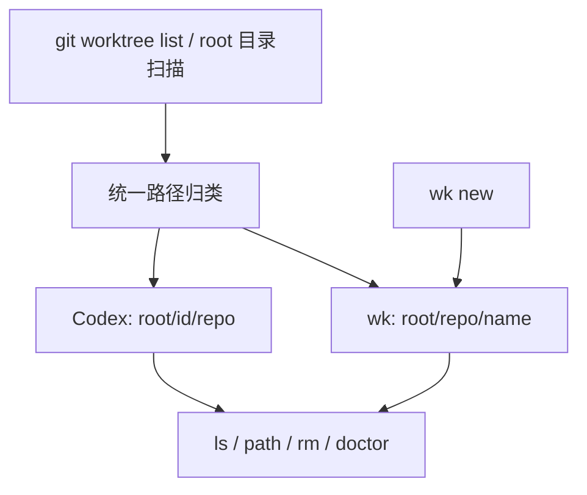

# Codex Worktree 目录兼容计划

## 概述

让 `wk` 在保留现有创建布局的同时，识别并管理 Codex 当前使用的
`<root>/<4位ID>/<repo名>` worktree 目录。

## 当前问题分析

`wk` 只识别 `<root>/<repo名>/<worktree名>`。因此 Codex worktree 会被错误归类：

- `wk ls`、`wk path` 和 `wk rm` 无法在当前 repo 下找到它；
- `wk ls --all` 会交换 repo 名和 worktree 名；
- `wk doctor` 会把 Codex 的语义分支名误报为目录名不一致。

## 调用链 / 架构图

## 策略与方案

- `wk new` 继续创建 `<root>/<repo名>/<name>`，不改变既有目录和命名约定。
- 查询和删除命令同时接受两种布局；Codex worktree 使用 4 位 ID 作为稳定名称。
- 从 worktree 的 Git common-dir 获取真实 repo 名，避免误判 4 位 repo 名。
- `doctor` 只对 `wk` 创建的目录检查“目录名等于分支名”；Codex 分支名允许独立命名。
- 当 4 位 repo 名与 Codex ID 形成完全相同的两段路径时，优先按 Codex 布局解释。
- 不增加配置文件、注册表或新依赖。

## 实施步骤

- [x] 确认本机 Codex worktree 的真实目录和 Git 记录。
- [x] 增加两种布局归类和冲突检测测试。
- [x] 让 `ls`、`path`、`rm`、`doctor` 复用统一归类逻辑。
- [x] 更新用户文档和架构决策说明。
- [x] 修复其他 4 位 repo 路径误阻止 `wk new` 的审查问题。
- [x] 修复 Codex ID 与 repo 同名时 `doctor` 误报的审查问题。
- [x] 运行定向测试、完整测试和构建。

## 风险评估

| 风险 | 影响 | 缓解措施 |
| --- | --- | --- |
| 4 位普通 repo 名被当成 Codex ID | 列表和删除定位错误 | 使用 Git common-dir 的 repo 名判定布局 |
| Codex ID 与 4 位 repo 名完全相同 | 无法仅从路径区分两种布局 | 优先按 Codex 解释，避免误报其独立 branch 名 |
| 两种布局出现同名 worktree | `path` 或 `rm` 定位不唯一 | 返回明确的重名错误，不静默选择 |
| Codex 后续改变内部布局 | 新结构无法识别 | 将兼容范围限定为当前已验证布局，不猜测未来结构 |
| `doctor` 套用错误命名约束 | 合法 Codex worktree 被误报 | 仅对 `wk` 布局执行目录名与分支名一致检查 |

## 成功标准

1. 当前 repo 的 `wk ls` 能列出两种布局，Codex worktree 的名称为 4 位 ID。
2. `wk path <ID>` 和 `wk rm <ID>` 能定位 Codex worktree。
3. `wk ls --all` 正确显示 Codex worktree 的 repo、ID 和路径。
4. `wk doctor` 接受分支名与 ID 不同的健康 Codex worktree。
5. `wk new` 的创建路径和原有行为不变。
6. `go test ./...` 和 `go build ./...` 通过。

## 进度跟踪

- ✅ 完成现状和调用链确认。
- ✅ 完成回归测试与实现。
- ✅ 更新文档和架构决策。
- ✅ `go test ./...`、`go vet ./...`、`go build ./...` 全部通过。
- ✅ 使用真实 `~/worktrees` 验证 `ls`、`ls --all`、`path` 和 `doctor`。
- ✅ 两条审查回归测试先稳定失败，修复后通过；真实目录只读烟测再次通过。

## 相关文件

- `cmd/root.go`
- `cmd/new.go`
- `cmd/ls.go`
- `cmd/path.go`
- `cmd/rm.go`
- `cmd/doctor.go`
- `cmd/root_test.go`
- `cmd/new_test.go`
- `cmd/doctor_test.go`
- `internal/gitx/gitx.go`
- `internal/gitx/gitx_test.go`
- `README.md`
- `docs/GLOSSARY.md`
- `docs/adr/0002-stateless-no-config.md`
- `docs/adr/0003-naming-strategy.md`
