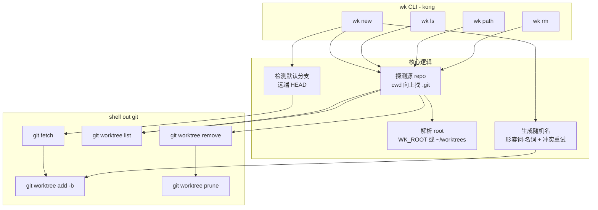

# wk —— worktree CLI 工具 开发计划

## Overview

`wk`（worktree kit）是一个把 GitHub Copilot App 的 worktree 管理体验独立出来的命令行工具。核心价值：**把散落各处 repo 的 git worktree 统一收纳到一个全局根目录，用可读的随机名快速创建。**

MVP 聚焦 worktree 的全生命周期：创建、列表、删除、取路径。**不做** cd/shell 集成（切换交给用户），**不接** AI。

## Current Problem Analysis

手动用 `git worktree` 的痛点：
1. 要自己想目录路径、自己保证不冲突。
2. worktree 散落在各 repo 旁边，缺乏集中总览。
3. 起点分支容易忘记先 `fetch`，基于过期的本地 main。
4. 命令冗长（`git worktree add ../some-path -b branch origin/main`）。

`wk` 用一条命令解决：自动集中目录 + 自动最新起点 + 自动随机命名。

## Strategy and Approach

**架构决策（详见 `docs/adr/`）：**
- ADR-0001：Go + kong 实现，git 操作 shell out。
- ADR-0002：无状态、无配置文件，源 repo 靠 cwd 探测，root 靠 `WK_ROOT` 环境变量（默认 `~/worktrees`）。
- ADR-0003：目录名 = 随机"形容词-名词"且不可变，与 branch 名恒等（不提供 rename）；stable key = 目录名。
- ADR-0004：创建前尝试 fetch，在线用 `origin/<默认分支>`、离线降级用本地默认分支；删除只删目录、保留 branch。

**目录结构：** `<root>/<repo名>/<随机名>/`

**命令面 (MVP)：**

| 命令 | 作用 |
| --- | --- |
| `wk new` | 在当前源 repo 内，从最新默认分支创建 worktree（随机名做目录名 + branch 名），打印路径 |
| `wk ls` | 列出当前 repo 的 worktree（目录名、branch 名、路径分列）；`--all` 列出所有 repo |
| `wk path <目录名>` | 输出该 worktree 的绝对路径（方便 `cd $(wk path xxx)` 或脚本化） |
| `wk rm <目录名>` | 删除 worktree 目录（保留 branch），脏则需 `--force`；随后 prune |

> 注：早期版本提供过 `wk rename`（只改 branch 让其与目录分叉），后移除以保持"目录名 = branch 名恒等"。

## Call Chain / Architecture

## Implementation Steps

### Phase 1 — 项目骨架 ✅
- [x] `go mod init`，引入 kong
- [x] 根命令 + 帮助
- [x] `internal/` 包结构：`gitx`（git shell out 封装）、`config`（root 解析）、`naming`（随机名）
- [x] repo 探测：通过 git 解析源 repo 名
- [x] root 解析：`WK_ROOT` → 默认 `~/worktrees`

### Phase 2 — 创建 (`wk new`) ✅
- [x] 默认分支检测（`git symbolic-ref refs/remotes/origin/HEAD` 兜底 main/master）
- [x] 自动 `git fetch`
- [x] 随机名生成（形容词/名词词表，冲突则重试）
- [x] `git worktree add <root>/<repo>/<name> -b <name> <start-point>`
- [x] 打印创建结果（路径 + branch）

### Phase 3 — 查询 (`wk ls` / `wk path`) ✅
- [x] 解析 `git worktree list --porcelain`，过滤属于当前 repo 的
- [x] `ls`：表格输出目录名 / branch 名 / 路径；`--all` 跨 repo
- [x] `path <目录名>`：解析并输出绝对路径，找不到报错

### Phase 4 — 删除 (`wk rm`) ✅
- [x] `rm`：`git worktree remove <path>`（脏则提示 `--force`）→ `git worktree prune`

### Phase 5 — 打磨与分发 ✅（发布自动化可选）
- [x] 错误信息友好化（不在 repo 内、离线 fetch 失败、名字找不到）
- [x] README（安装、用法、`cd $(wk path)` 提示）
- [x] 基础测试（naming 冲突重试、repo/root 解析、porcelain 解析）
- [ ] 可选：交叉编译产物 / GitHub Release（需要时再加 goreleaser）

## Risk Assessment

| 风险 | 影响 | 缓解 |
| --- | --- | --- |
| 离线时 `wk new` 的 fetch 失败 | 起点可能过期 | 降级为警告不报错，回退本地默认分支，仍能创建 |
| 默认分支检测不到（无 origin/HEAD） | 起点错误 | 依次尝试 origin/HEAD → main → master，都失败则报错 |
| 随机名冲突（目录或同名 branch） | 创建失败 | 生成时检测目录/branch 存在则重试 N 次 |
| 删除误伤未提交改动 | 丢代码 | 依赖 git 脏检查，默认拒绝，需 `--force` |
| 在 worktree 内（而非源 repo）跑命令 | 解析歧义 | git 从 worktree 也能解析回源 repo，统一用 toplevel 归一 |

## Success Criteria

1. 在任意 git repo 内 `wk new` 一条命令，得到 `<root>/<repo>/<随机名>` 的干净 worktree，基于最新 `origin/默认分支`。
2. `wk ls` 清晰列出当前 repo 所有 worktree（目录名、branch、路径分列）。
3. `wk rm` 默认不丢未提交代码，删除后无悬挂 worktree 记录。
4. `cd $(wk path <名>)` 能正确进入。
5. 单二进制，`git` 之外零运行时依赖。

## Progress Tracking

- ✅ Phase 1 项目骨架
- ✅ Phase 2 创建
- ✅ Phase 3 查询
- ✅ Phase 4 删除
- ✅ Phase 5 打磨与分发（README、单元测试、构建通过；goreleaser 待需要时再加）

**验证结果（真实 repo + 远端端到端测试全部通过）：**
- `wk new`：在线 fetch 从 `origin/main` 建；离线降级用本地分支不报错；纯本地 repo 也可 ✅
- `wk ls` / `--all`：目录名 / branch / 路径分列（二者恒等）✅
- `wk path`：输出绝对路径 ✅
- `wk rm`：脏拒绝、`--force` 生效、branch 保留 ✅
- 边界：不在 repo 内报错；在 worktree 内运行能归一回源 repo ✅
- 单元测试：config / naming / porcelain 解析全绿 ✅

## Related Files（预期）

- `main.go` — 入口
- `cmd/` — kong 子命令（new / ls / path / rm）
- `internal/gitx/` — git shell out 封装
- `internal/config/` — root 解析（WK_ROOT）
- `internal/naming/` — 随机名生成
- `docs/adr/` — 架构决策记录
- `docs/GLOSSARY.md` — 术语表
- `README.md` — 用户文档
