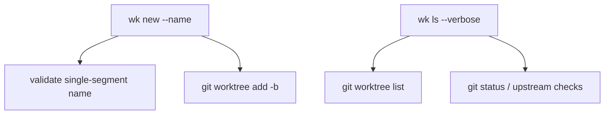

# wk Core Worktree Features Plan

## Overview

This change keeps `wk` focused on daily git worktree use: named creation and
status-aware listing.

## Current Problem Analysis

The MVP can create, list, locate, and remove worktrees, but two common
workflows still require manual git commands:

1. Creating a worktree with a meaningful task name.
2. Seeing whether listed worktrees have local changes or upstream drift.

## Call Chain / Architecture Diagram

## Strategy and Approach

- Preserve the stateless design: no registry and no config file.
- Preserve the naming invariant: directory name and branch name match.
- Keep default output stable; add extra data only behind explicit flags.

## Implementation Steps

- [x] Document the feature batch before implementation.
- [x] Add `wk new --name <name>` with single-segment name validation.
- [x] Add `wk ls --verbose` with dirty/upstream/ahead/behind columns.
- [x] Update README and glossary.
- [x] Add unit tests and smoke tests.

## Risk Assessment

| Risk | Impact | Mitigation |
| --- | --- | --- |
| Explicit names break branch rules | `git worktree add` fails late | Validate the name before creation with both local rules and git branch validation |
| Verbose listing is slower | Many worktrees run more git commands | Keep default `wk ls` unchanged |

## Success Criteria

1. `wk new --name feature-one` creates `<root>/<repo>/feature-one` on branch
   `feature-one`.
2. `wk ls` output remains unchanged.
3. `wk ls --verbose` shows dirty state and upstream counts when available.
4. Tests and smoke checks pass without touching the user's real worktree root.

## Progress Tracking

- ✅ Documentation drafted.
- ✅ Implementation complete.
- ✅ Unit tests and smoke tests pass.

## Related Files

- `cmd/new.go`
- `cmd/ls.go`
- `cmd/root.go`
- `internal/gitx/gitx.go`
- `README.md`
- `docs/GLOSSARY.md`
